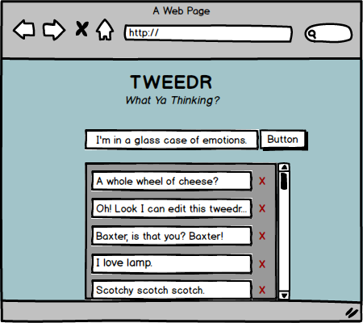

# HOMEWORK: Tweedr!!!

Let's make a cool new app called TWEEDR!! Not Twitter, geez...

An Express backend has already been provided for you, because we love you all very much. You will just need to create a React frontend for it. (You shouldn't need to modify anything in the Express backend, except to connect the React frontend. The model, controllers, etc. are all set up already.)

## [Read this](./tweedr) for setup instructions and API documentation!

### Wireframe!

### Description

- When the app loads, 
    - all the tweeds in the database are loaded.
- When a tweed is typed into the input bar, 
    - and the submit button is clicked, 
    - that tweed is created in the database
    - and the tweedlist is rerendered on the page.
- When an individual tweed is clicked,
    - it becomes editable (maybe a `Tweed` component is swapped out with an `EditForm` component? 🤔)
    - And when the edited tweed is submitted,
        - a `PUT` request is made to the express app
        - and the tweedlist is rerendered on the page to reflect the changes
- When the `X` next to each tweed is clicked,
    - the tweed is deleted
    - and the tweedlist is rerendered on the page to reflect the changes.

## 🚀 Completion looks like:

Your React/Express app should:

- Take an input of a Tweed
- Render all the Tweeds from the database into the browser
- Accomplish this with at least five components, possibly more:
    - `App`: holds calls to the database
    - `AddForm`: will take a text input and allow it to be submitted into the database
    - `TweedrFeed`: Holds Tweed components, which reflect the information in the database
    - `Tweed`: Holds one individual tweed
    - `EditForm`: Has a prepopulated text field with the value of the individual tweed

Any other components you see fit!

## 🚀 Your homework submission should include:

- A pull request created on _this repo_.
- Completion, comfort, wins, losses, questions... you know the drill.

## This homework is due 🚨 11PM ON THURSDAY NIGHT 🚨